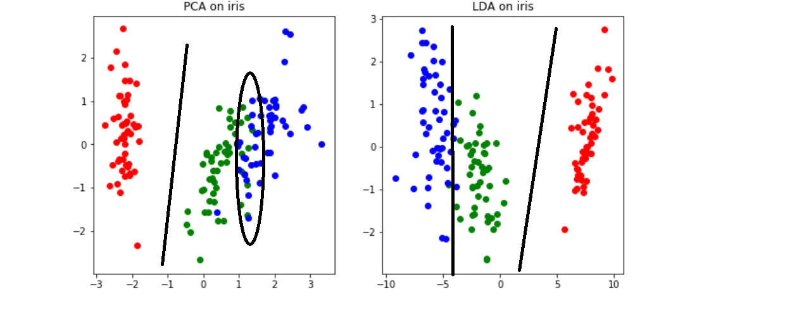

## Essence of Dimensionality Reduction:
It’s not feasible to analyze each and every dimension at a microscopic level in high-dimensional data. It might take us days or months to perform any meaningful analysis which requires a lot of time, money, and manpower in our business, which is not often encouraged. Training data with high dimensions will lead to problems like:

- Space required to store the data gets increased with increasing dimensions.
- Less dimensions will take low time complexity in training a model.
- As dimensions increase, the possibility of overfitting the model also increases.
- We cannot visualize high-dimensional data. By dimensionality reduction, we will reduce the data to 2D or 3D for better visualization.
- It will remove all the correlated features in our data.

### Components of Dimensionality Reduction:
There are two major components of dimensionality reduction which will be discussed in detail here.

#### I) Feature Selection:

Feature selection involves finding a subset of original data so that there will be a minimum loss of information. It has the following three strategies:

- Filter Strategy: Strategy to gain more information on the data.
- Wrapper Strategy: Basing on the model accuracy we will select features.
- Embedded Strategy: Basing on model prediction errors, we will take a decision whether to keep or remove the selected features.

#### II) Feature Projection:

Feature Projection, also known as Feature Extraction, is used to transform the data in high-dimensional space to low-dimensional space. The data transformation can be done in both linear and non-linear ways.

- For linear transformation, we have Principal Component Analysis (PCA), Linear Discriminant Analysis (LDA).

### PCA (Done)
PCA is mostly used as a tool in exploratory data analysis (EDA) and for making predictive models. PCA can be done by eigenvalue decomposition of a data covariance (or correlation) matrix or singular value decomposition of a data matrix.

#### Advantages:
- It removes correlated features.
- Improves model efficiency.
- Reduces overfitting.
- Improves Visualization.

#### Disadvantages:
- PCA is a linear algorithm and it won’t work very well for polynomial or other complex functions. We can somehow use kernel PCA for such data.
- After PCA, we may lose a lot of information if we won’t choose the right number of dimensions to get eliminated.
- Less interpretability

## LDA
PCA tries to find the components that maximizes the variance, while on the other hand LDA tries to find the new axes that:

1) Maximizes the separability of the categories and

2)  Minimizes the variance among categories.

By minimizing the variance, we can well separate the clusters of individual groups. Hence it is as important as maximizing the mean values of groups.

Comparision between PCA and LDA:

To know the difference between the working of PCA and LDA, let’s look at the following plot. Where PCA tries to maximizes the variance unlike LDA which tries to maximizes the separability of three categories.

We can see the difference between the both plots. In PCA, their is some overlapping in the data and it is difficult to find a line separating the two groups. LDA can help us to separate the three groups since their is less overlapping in the data.

## SVD:

Singular Value Decomposition is a matrix factorization technique widely used in various applications, including linear algebra, signal processing, and machine learning. It decomposes a matrix into three other matrices, allowing for the representation of the original matrix in a reduced form.

🔍 Title: "Singular Value Decomposition (SVD): Overview"

Singular Value Decomposition (SVD) is a 🚀 powerful tool in numerical linear algebra for data processing, particularly for data reduction and dimensionality reduction.
It is likened to a 🎨 data-driven generalization of the Fourier transform, allowing the creation of tailored coordinate systems or transformations based on specific data.
SVD is utilized in various applications, including solving linear systems of equations, principal component analysis (PCA), and building models for linear regression.
Widely used across industries, SVD is integral to algorithms such as Google's PageRank, facial recognition systems, and recommender systems like those used by Amazon and Netflix.
SVD is prized for its simplicity, interpretability, scalability, and applicability to diverse data sets, making it a valuable tool for leveraging linear algebra in practical contexts. 🛠️📊🌐

Comparision:
Conclusion
The choice between Principal Component Analysis (PCA), Linear Discriminant Analysis (LDA), and Singular Value Decomposition (SVD) depends on the specific objectives and characteristics of the data. Here are general guidelines on when to use each technique:

1. PCA (Principal Component Analysis)

Use Cases:
1. When the goal is to reduce the dimensionality of the dataset.
2. In scenarios where capturing global patterns and relationships within the data is crucial.
3. For exploratory data analysis and visualization.

2. LDA (Linear Discriminant Analysis)

Use Cases:
1. In classification problems where enhancing the separation between classes is important.
2. When there is a labeled dataset, and the goal is to find a projection that maximizes class discrimination.
3. LDA is particularly effective when the assumption of normally distributed classes and equal covariance matrices holds.

3. SVD (Singular Value Decomposition)

Use Cases:
1. When dealing with sparse data or missing values.
2. In collaborative filtering for recommendation systems.
3. SVD is also applicable in data compression and denoising.