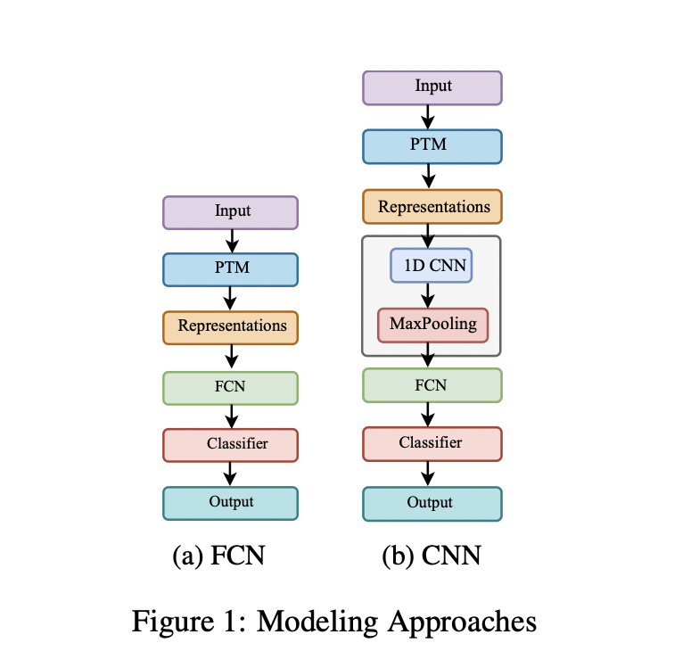
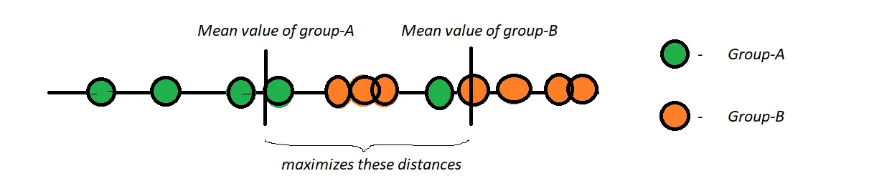
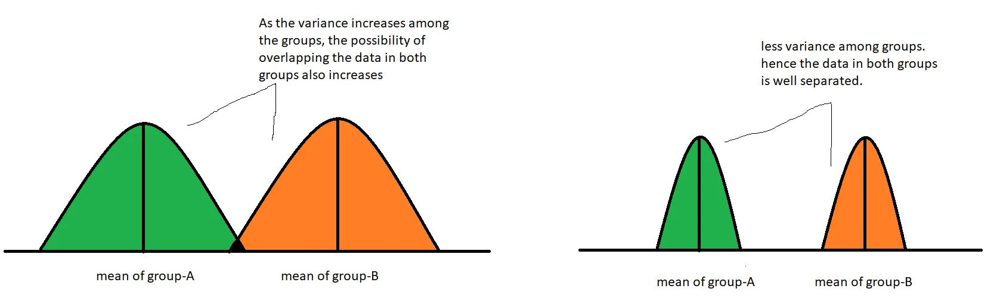
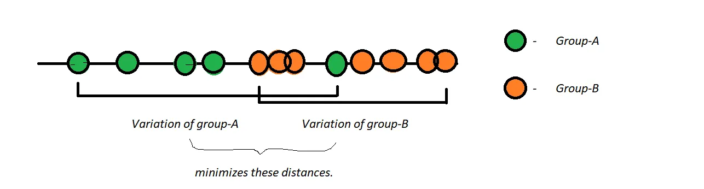
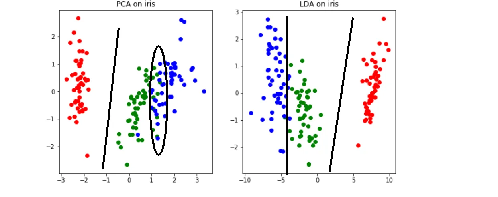
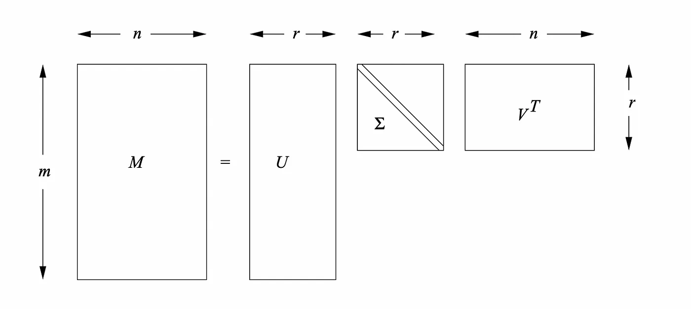

# Paper Summaries

## Paper 1: Transforming the Embeddings: A Lightweight Technique for Speech Emotion Recognition Tasks

### Objective
This paper aims to investigate the efficacy of repurposing Pre-trained Models (PTMs) originally designed for speaker recognition in Speech Emotion Recognition (SER) tasks. It posits that the insights gained from speaker recognition, such as nuances in tone and pitch, could enhance SER performance.

### Summary of Sections 2 and 3
1. Comparative analysis of five model embeddings: x-vector, ECAPA, wav2vec 2.0, wavLM, and Unispeech-SAT.
2. All models trained with a sampling rate of 16 kHz.
3. Final hidden states extracted from wavLM, UniSpeech-SAT, and wav2vec 2.0, transformed into 768-dimensional vectors per audio file, serving as input features for downstream classifiers using average pooling.
4. Among SSL-based methods, wavLM and UniSpeech-SAT outperform wav2vec 2.0.
5. x-vector and ECAPA are supervised models, with ECAPA being a modified version of x-vector.
6. Speech processing Universal PERformance Benchmark (SUPERB) employed to evaluate SSL PTM features across various tasks including speaker identification, SER, speech recognition, and voice separation.

### Additional Notes
- SUPERB offers a comprehensive evaluation of SSL PTM features across diverse tasks.

#### Models:
- **x-vector**: A DNN generating fixed-dimensional embeddings from speech segments.
- **ECAPA**: A robust speaker identification method combining TDNNs with attention mechanisms.
- **Wav2Vec 2.0**: SSL model for speech recognition utilizing CNNs and Transformer architecture.
- **WavLM**: A waveform-based language model operating directly on raw audio for tasks like speech recognition, using CNNs and RNNs.
- **UniSpeech-SAT**: A method for speech synthesis leveraging elements of Tacotron and Transformer architectures.

## Paper 2: Heterogeneity over Homogeneity: Investigating Multilingual Speech Pre-Trained Models for Detecting Audio Deepfake

This paper compares eight PTMs:

1) Multilingual PTMs: XLS-R, Whisper, and Massively Multilingual Speech
2) Monolingual PTMs: WavLM, Unispeech-SAT, Wav2vec2 (based on SUPERB)
3) Speaker recognition PTM: x-vector; Emotion recognition PTM: XLSR_emo.

### Objective
1) Multilingual PTMs excel in Audio Deepfake Detection (ADD) tasks.
2) Proposing a framework, Merge into One (MiO), to combine representations from different PTMs, inspired by the complementarity observed in other speech processing tasks.

### Equal Error Rate (EER)
EER represents the point where False Acceptance Rate (FAR) equals False Rejection Rate (FRR).

### Modeling Approaches
1(a): Fully Connected Network (FCN)
1(b): Convolutional Neural Network (CNN)

### MiO:
MiO follows a consistent modeling pattern for each incoming representation, applying linear projection to a 120-dimensional space followed by bilinear pooling (BP) to facilitate effective feature interaction. BP involves the outer product of two vectors p and q of dimension (D,1), resulting in a matrix of dimension (D, D), represented as:
BPD,
D = pD,1 ⊗ qD,1 = pqT

In MiO, multiple PTMs are integrated, with performance explanations provided in the appendix.

Appendix:

1) Dataset: 4 dataset, ASV, ITW and DC-C, DC-E

2) Detailed Information of the Pre-Trained Models: XLS-R(1 billion parameters), Whisper(74 million), MMS(1 billion)[PTM's multiligual.] Unispeech-SAT(94 Million), WavLM(base(94 Million) and large(316 Million)), Wav2vec2(95 Million), X-vector(supervised)(4.2 Million), XLSR-emo.

3) Cross-Corpus Evaluation:

First Experiment(PTMs): Cross corpus experiment with 120 and 240 dimensions with PCA.[best is XLS-R]

Second Experiment(MIO): Cross corpus experiment with 120 and 240 dimensions with PCA.[only two combinations(1.XLS-R + x-vector) (2.Whisper + Unispeech-SAT)]

## Paper 3: Applying unsupervised Dimensionality Reduction techniques on Setence Embeddings 

Issue: Memory and Compute intensive if there are higher dimensional embeddings 
PLM's or PTM's have a very high dimension (1024 - 4096).

Objective:  Reduce the dimensional of embeddingsApplying Unsupervised DR techniques on the Embeddings given out by PTM's.

Five dimensionality reduction methods:

 SVD, PCA, GRP, KPCA , LDA and Autoencoders(Single-hidden layer)

## Essence of Dimensionality Reduction:
It’s not feasible to analyze each and every dimension at a microscopic level in high-dimensional data. It might take us days or months to perform any meaningful analysis which requires a lot of time, money, and manpower in our business, which is not often encouraged. Training data with high dimensions will lead to problems like:

- Space required to store the data gets increased with increasing dimensions.
- Less dimensions will take low time complexity in training a model.
- As dimensions increase, the possibility of overfitting the model also increases.
- We cannot visualize high-dimensional data. By dimensionality reduction, we will reduce the data to 2D or 3D for better visualization.
- It will remove all the correlated features in our data.

### Components of Dimensionality Reduction:
There are two major components of dimensionality reduction which will be discussed in detail here.

#### I) Feature Selection:

Feature selection involves finding a subset of original data so that there will be a minimum loss of information. It has the following three strategies:

- Filter Strategy: Strategy to gain more information on the data.
- Wrapper Strategy: Basing on the model accuracy we will select features.
- Embedded Strategy: Basing on model prediction errors, we will take a decision whether to keep or remove the selected features.

#### II) Feature Projection:

Feature Projection, also known as Feature Extraction, is used to transform the data in high-dimensional space to low-dimensional space. The data transformation can be done in both linear and non-linear ways.

- For linear transformation, we have Principal Component Analysis (PCA), Linear Discriminant Analysis (LDA).

### PCA (Done)
PCA is mostly used as a tool in exploratory data analysis (EDA) and for making predictive models. PCA can be done by eigenvalue decomposition of a data covariance (or correlation) matrix or singular value decomposition of a data matrix.

#### Advantages:
- It removes correlated features.
- Improves model efficiency.
- Reduces overfitting.
- Improves Visualization.

#### Disadvantages:
- PCA is a linear algorithm and it won’t work very well for polynomial or other complex functions. We can somehow use kernel PCA for such data.
- After PCA, we may lose a lot of information if we won’t choose the right number of dimensions to get eliminated.
- Less interpretability

## LDA(todo)
PCA tries to find the components that maximizes the variance, while on the other hand LDA tries to find the new axes that:

1) Maximizes the separability of the categories and

2)  Minimizes the variance among categories.

By minimizing the variance, we can well separate the clusters of individual groups. Hence it is as important as maximizing the mean values of groups.

Comparision between PCA and LDA:

To know the difference between the working of PCA and LDA, let’s look at the following plot. Where PCA tries to maximizes the variance unlike LDA which tries to maximizes the separability of three categories.

We can see the difference between the both plots. In PCA, their is some overlapping in the data and it is difficult to find a line separating the two groups. LDA can help us to separate the three groups since their is less overlapping in the data.

## SVD(todo):

Singular Value Decomposition is a matrix factorization technique widely used in various applications, including linear algebra, signal processing, and machine learning. It decomposes a matrix into three other matrices, allowing for the representation of the original matrix in a reduced form.

Comparision:
Conclusion
The choice between Principal Component Analysis (PCA), Linear Discriminant Analysis (LDA), and Singular Value Decomposition (SVD) depends on the specific objectives and characteristics of the data. Here are general guidelines on when to use each technique:

1. PCA (Principal Component Analysis)

Use Cases:
1. When the goal is to reduce the dimensionality of the dataset.
2. In scenarios where capturing global patterns and relationships within the data is crucial.
3. For exploratory data analysis and visualization.

2. LDA (Linear Discriminant Analysis)

Use Cases:
1. In classification problems where enhancing the separation between classes is important.
2. When there is a labeled dataset, and the goal is to find a projection that maximizes class discrimination.
3. LDA is particularly effective when the assumption of normally distributed classes and equal covariance matrices holds.

3. SVD (Singular Value Decomposition)

Use Cases:
1. When dealing with sparse data or missing values.
2. In collaborative filtering for recommendation systems.
3. SVD is also applicable in data compression and denoising.