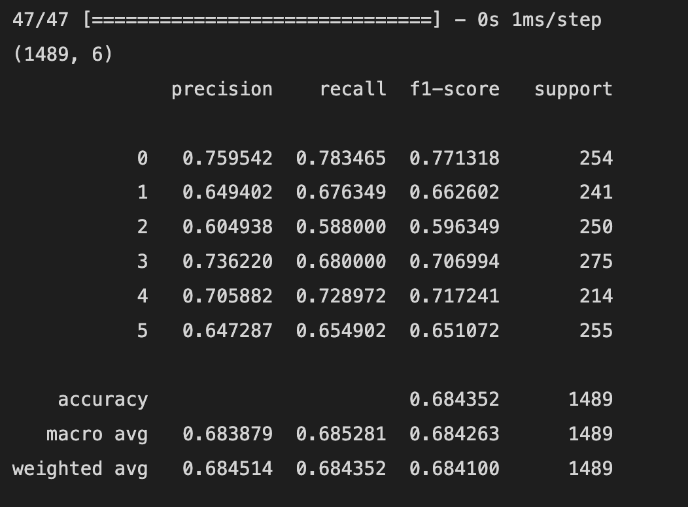

# This File will contain schedule or upcoming todos:

8-April-2024: Section 1 to 3.(Done):
9-April-2024: Section 4 to 5.(Done)

Later Todos:
1) Understand the architecture and code for x-vector, ECAPA, wav2vec 2.0, wavLM, and Unispeech-SAT.(Done)

2) Try hugging face spaces and models(Done)
    https://huggingface.co/spaces/ZionC27/Speech-Emotion-Recognition

3) Learn more about the SUPERB benchmark.

4) wav2vec 2.0 with hugging face transformers:
https://mohitmayank.com/a_lazy_data_science_guide/audio_intelligence/wav2vec2/

Section 1 to 3 (10 April):(Done)

Section 4 to 6 (11 April):(Done)

Appendix 9.1 to 9,3 (12 April) (Done)

Understand the code for paper1, i.e. the pipeline for the CREMA-D evaluation dataset, and SER.(Done)

Plan ahead(23 April):

1) Go through dimensionality reduction methods SVD, PCA, and LDA(Done)

 GRP, KPCA and Autoencoders(Single-hiddle layer)(Done)

2) Create an environment for the pipeline. (Done)

3) We will go through the pipeline and run it end-to-end on GPU. (Done)

4) Apply dimensionality reduction methods learned above in the SER pipeline.(Done):

4a) PCA, KPCA, SVD, LDA, GRP:

Experiment 1(Done): Embedding size of 120. (Compare the result) with the same model.

Experiment 2(Done): Embedding size of 240. (Compare the result) with the same model.

**All results are updated in results_document.md document.**

We have to do atleast with two more (Fully connected network or MLP and SVM an classical ML)....

4b ) Add TSNE plots to the tsne_plt and comparison of train time.(TODO)

5) a) MLP 240 (Done)

MLP 120 (Done))

 b) SVM(Todo)

6) Modify the pipeline for SER and use multiple PTMs ((TODO)) from huggingface. (TODO)

7) Code walkthrough for paper 2.(TODO)

