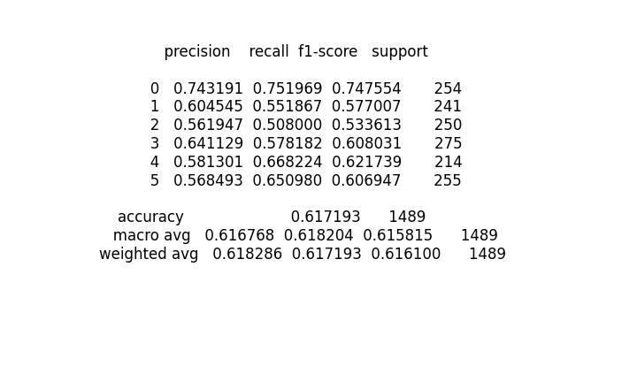

# Classification Report for different randomly selecting embedding values and CNN model

# Run 1 

## Original Result(Result with embedding size 512)

## Randomly Selecting 384 

## Randomly Selecting 240 

## Randomly Selecting 120 

# Run 2 

## Result with embedding size 512

## Randomly Selecting 384 

## Randomly Selecting 240 

## Randomly Selecting 120 

# Run 3

## Result with embedding size 512

## Randomly Selecting 384 

## Randomly Selecting 240 

## Randomly Selecting 120 

