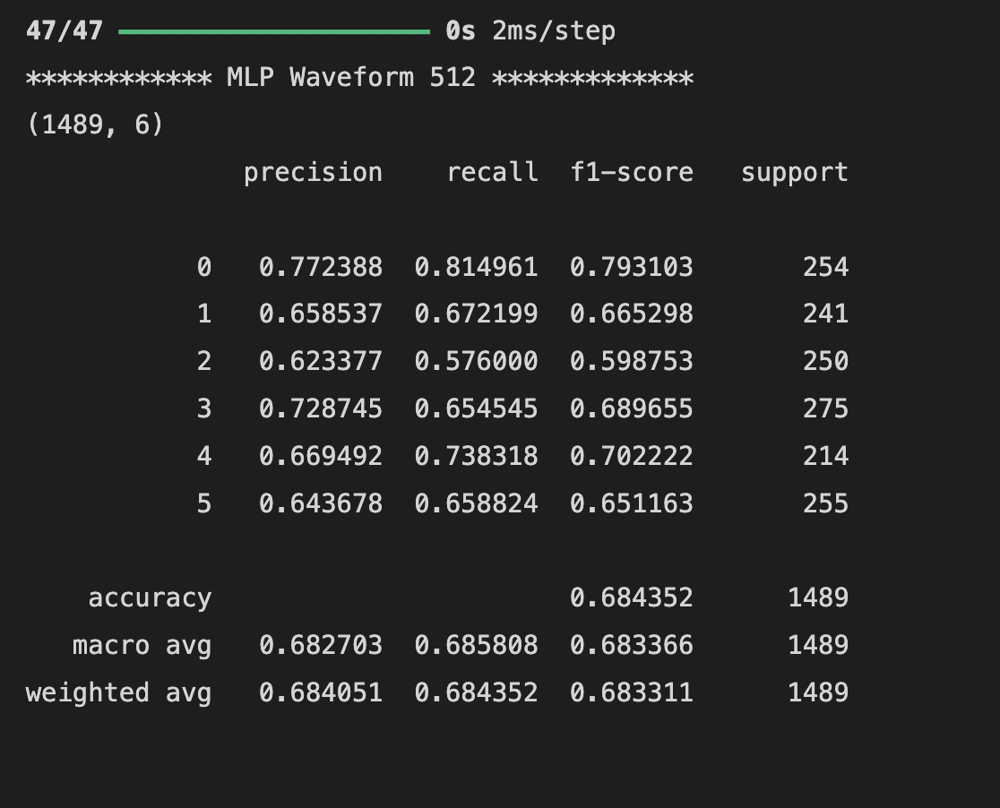
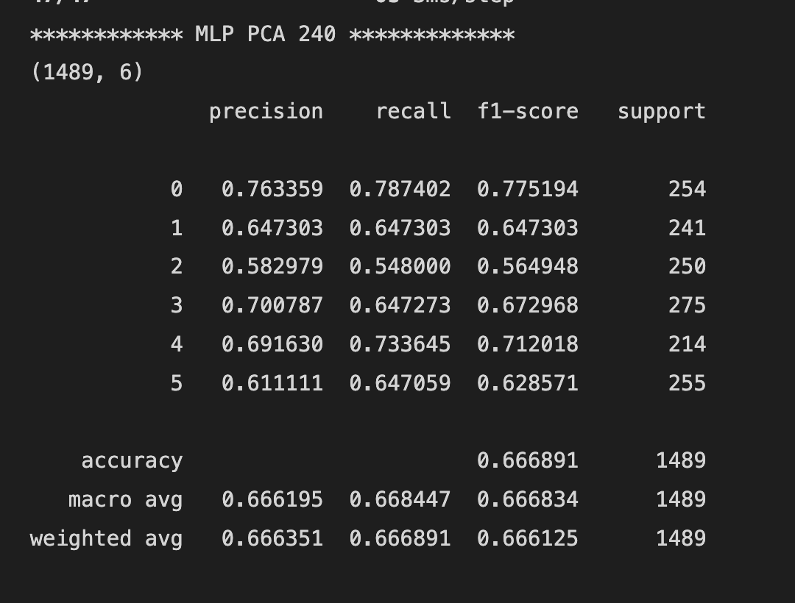
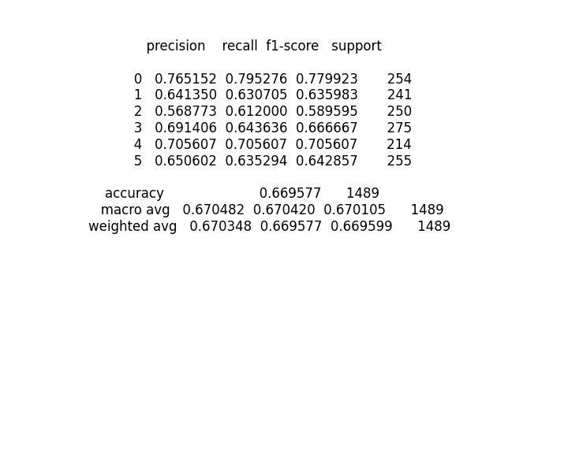
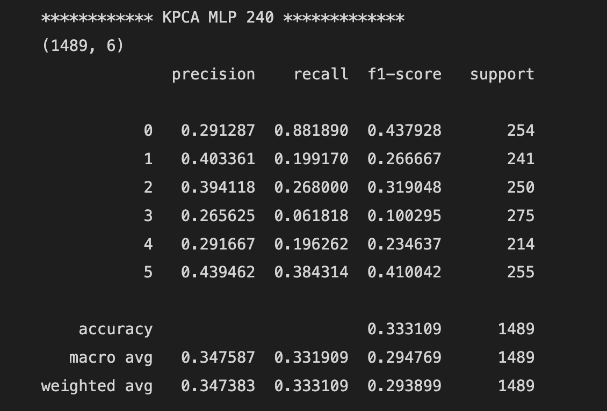
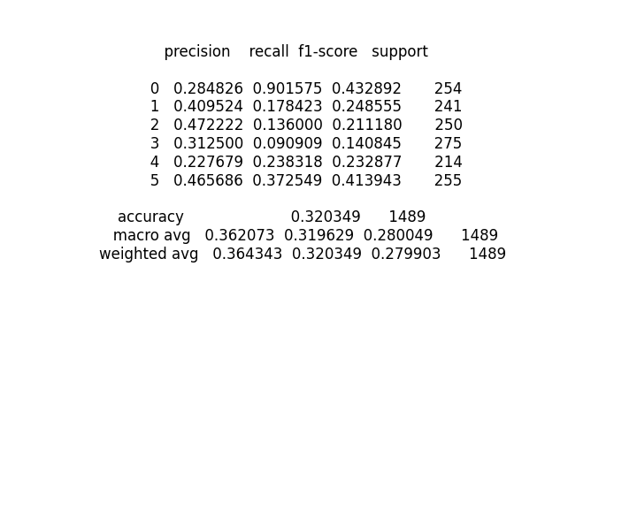
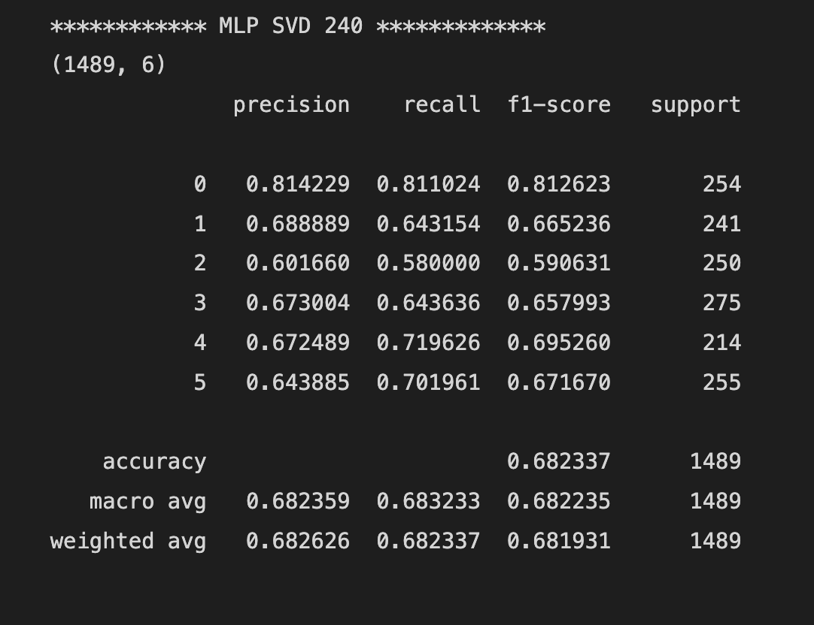
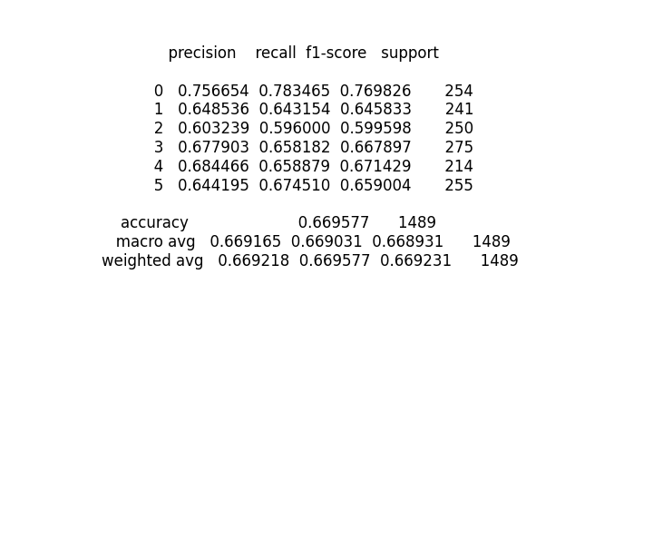
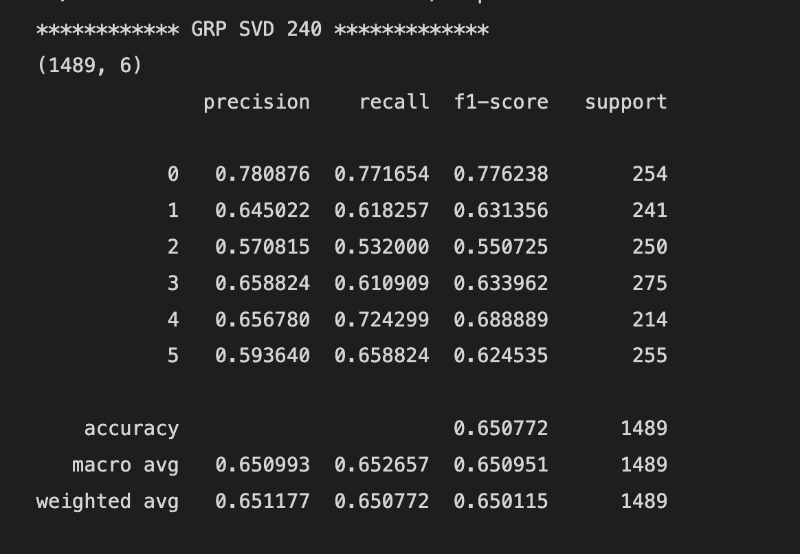
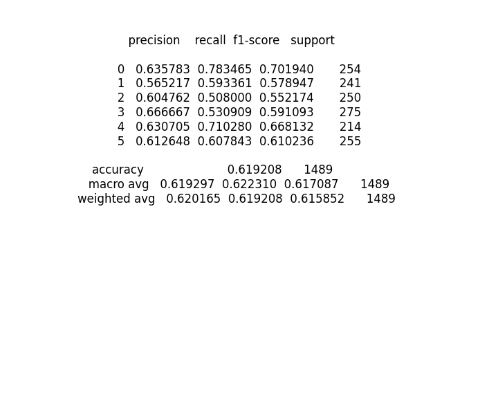
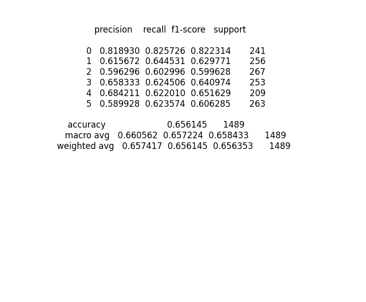

# Results with different Dimensionality Reduction Methods and MLP as classifcation network

## Original Result

## PCA with Dimentiality 240

## PCA with Dimentiality 120

## KPCA with Dimentiality 240

## KPCA with Dimentiality 120

## SVD with Dimentiality 240

## SVD with Dimentiality 120

## GRP with Dimentiality 240

## GRP with Dimentiality 120

## LDA with Dimentiality 5 (Exceptional CASE)

